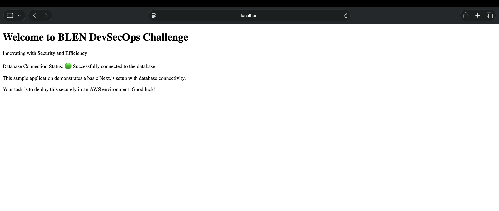

# BLEN DevSecOps Take-Home — Kodzovi Luc Mally

Secure three-tier AWS architecture built with Terraform, containerized with Docker Compose, and validated through GitHub Actions CI/CD with security scanning at every layer.

## Architecture Overview

```
Internet
   │
   ▼
┌──────────────────────────────────────────────────┐
│  Public Subnets (2 AZs)                          │
│  ┌──────────────────────────────────────────┐    │
│  │  Application Load Balancer               │    │
│  │  - HTTPS (443) with TLS 1.3              │    │
│  │  - HTTP (80) → 301 redirect to HTTPS     │    │
│  │  - Drop invalid headers enabled          │    │
│  └──────────────┬───────────────────────────┘    │
│                 │                                │
├─────────────────┼────────────────────────────────┤
│  Private Subnets (2 AZs)                         │
│  ┌──────────────▼───────────────────────────┐    │
│  │  ECS Fargate Service (2 tasks)           │    │
│  │  - Next.js app on port 3000              │    │
│  │  - Secrets injected from Secrets Manager │    │
│  │  - Read-only root filesystem             │    │
│  └──────────────┬───────────────────────────┘    │
│                 │                                │
├─────────────────┼────────────────────────────────┤
│  Isolated Subnets (2 AZs) — no internet route    │
│  ┌──────────────▼───────────────────────────┐    │
│  │  RDS PostgreSQL 17.4 (Multi-AZ)          │    │
│  │  - Encrypted at rest (AES-256)           │    │
│  │  - IAM authentication enabled            │    │
│  │  - Performance Insights with KMS CMK     │    │
│  └──────────────────────────────────────────┘    │
└──────────────────────────────────────────────────┘
```

## Repo Structure

```
.
├── .github/workflows/
│   ├── pr.yml              # PR checks — runs on every pull request to main
│   └── merge.yml           # Merge pipeline — runs on push to main, pushes image to GHCR
├── app/                    # Provided Next.js application (not modified)
├── images/                 # Screenshots for documentation
├── terraform/
│   ├── main.tf             # Root module — wires everything together
│   ├── variables.tf        # Input variables with sensible defaults
│   ├── providers.tf        # AWS provider config
│   ├── outputs.tf          # Root module outputs
│   ├── terraform.tfvars    # Variable overrides
│   ├── .tflint.hcl         # TFLint configuration
│   └── modules/
│       ├── vpc/            # VPC, subnets (public/private/isolated), NAT GWs, flow logs
│       ├── alb/            # Application Load Balancer, target group, HTTPS/HTTP listeners
│       ├── ecs/            # ECS cluster, task definition, Fargate service, IAM roles
│       ├── db/             # RDS PostgreSQL, subnet group, monitoring role
│       ├── secrets/        # Secrets Manager for DB credentials, random password generation
│       └── kms/            # KMS CMK for encrypting CloudWatch, RDS insights, Secrets Manager
├── docker-compose.yml      # Local proof-of-life (Next.js + PostgreSQL)
├── .gitignore
└── challenge.md            # Original challenge instructions
```

## Terraform Modules

I split the infrastructure into six modules to keep things organized and to avoid circular dependencies. Security groups live in the root `main.tf` since they reference each other across tiers.

**vpc** — Builds a VPC with three subnet tiers across two AZs. Public subnets get an internet gateway and NAT gateways. Private subnets route outbound through NAT. Isolated subnets (for the database) have no internet route at all. VPC flow logs go to CloudWatch encrypted with KMS.

**alb** — Internet-facing ALB in the public subnets. HTTPS listener with TLS 1.3 policy, HTTP listener that does nothing but redirect to HTTPS. Health checks hit `/api/db-check`.

**ecs** — Fargate cluster running two tasks across private subnets. Task execution role pulls images and reads secrets from Secrets Manager. Task role has no permissions (least privilege). Container gets DB credentials injected as secrets, not environment variables.

**db** — RDS PostgreSQL 17.4 in isolated subnets. Multi-AZ, encrypted at rest, IAM auth enabled, performance insights with KMS, enhanced monitoring, auto minor upgrades. Deletion protection on.

**secrets** — Secrets Manager stores DB credentials (username, random 32-char password, dbname, port). Encrypted with KMS CMK.

**kms** — Single KMS key with rotation enabled. Used by CloudWatch log groups, RDS performance insights, and Secrets Manager. Key policy grants access to the root account and CloudWatch Logs service.

## Network Segmentation

Traffic only flows where it needs to. Each security group is scoped to specific ports and specific source/destination groups:

- ALB SG: inbound 443/80 from internet, outbound only to ECS on port 3000
- ECS SG: inbound 3000 from ALB only, outbound to RDS on 5432, HTTPS (443) for image pulls, and DNS (53)
- RDS SG: inbound 5432 from ECS only

No SSH, no broad CIDR ranges between tiers, no unnecessary egress.

## CI/CD Pipelines

### PR Workflow (`pr.yml`)

Runs on every pull request to `main`. All six jobs must pass:

| Job | Tool | What it does |
|-----|------|-------------|
| Terraform Validate & Lint | terraform, tflint, checkov | Format check, validate, lint, security scan |
| Dockerfile Lint | hadolint | Catches Dockerfile anti-patterns |
| Docker Build & Trivy Scan | trivy | Builds image, scans for OS and library CVEs |
| Application Security Scan | trivy fs | Scans app dependencies for known vulnerabilities |
| Secret Detection | gitleaks | Scans git history for leaked credentials |
| Docker Compose Integration | docker compose | Spins up app + postgres, hits `/api/db-check` |

### Merge Workflow (`merge.yml`)

Runs on push to `main`. Same six security jobs, plus a seventh:

- **Build & Push to GHCR** — only runs after all checks pass. Tags the image with both the git SHA and `latest`, pushes to `ghcr.io`.

## Security Posture

### Checkov Results

137 checks passed. 7 intentional skips with justifications:

| Skip | Reason |
|------|--------|
| CKV_AWS_91 | ALB access logs need an S3 bucket — out of scope |
| CKV_AWS_260 | Port 80 ingress is intentional for HTTPS redirect |
| CKV_AWS_130 | Public subnets need public IPs for ALB and NAT gateway |
| CKV2_AWS_30 | RDS query logging needs a custom parameter group — out of scope |
| CKV2_AWS_57 | Secret rotation needs a Lambda function — out of scope |
| CKV2_AWS_12 | Restricting the default VPC security group needs a separate resource — out of scope |
| CKV2_AWS_28 | WAF needs a WAFv2 WebACL resource — out of scope |

### Encryption

Everything that can be encrypted is encrypted:

- CloudWatch log groups (ECS + VPC flow logs) → KMS CMK
- RDS storage → AES-256
- RDS Performance Insights → KMS CMK
- Secrets Manager → KMS CMK
- ALB → TLS 1.3 in transit

### Trivy Findings (Documented, Not Fixable)

The provided application has known vulnerabilities that can't be resolved without modifying app code (which is out of scope):

**Container image (Alpine 3.21.3):**
- CVE-2025-15467 (CRITICAL) — OpenSSL remote code execution
- CVE-2025-69419, CVE-2025-69421 (HIGH) — OpenSSL PKCS#12 issues

**Node.js dependencies:**
- CVE-2025-29927 (CRITICAL) — Next.js 14.2.8 middleware authorization bypass
- 14 additional HIGH findings in next, cross-spawn, glob, minimatch, tar

These are reported in CI logs for visibility. In production, upgrading Next.js to 14.2.25+ and updating the Alpine base image would resolve the critical findings.

## Docker Compose Proof-of-Life

Running `docker compose up` locally starts the Next.js app and PostgreSQL. The `/api/db-check` endpoint confirms database connectivity:

```
$ curl localhost:3000/api/db-check
{"message":"Successfully connected to the database","success":true}
```



## Running Locally

```bash
# Clone the repo
git clone https://github.com/lucm9/Luc-blen-dev-sec-ops-engineer-take-home.git
cd Luc-blen-dev-sec-ops-engineer-take-home

# Start the app
docker compose up -d --build

# Check it
curl http://localhost:3000/api/db-check

# Validate Terraform
cd terraform
terraform init -backend=false
terraform validate
terraform fmt -check -recursive

# Tear down
cd ..
docker compose down -v
```

## What I'd Add With More Time

- CloudFront distribution in front of the ALB for caching and edge protection
- Route 53 for DNS management and health-checked routing
- AWS Network Firewall for VPC-level traffic inspection
- S3 bucket for ALB access logs
- WAFv2 WebACL on the ALB with rate limiting and OWASP rules
- Lambda-based secret rotation for Secrets Manager
- Custom RDS parameter group for query logging (`log_statement = 'all'`)
- Restrict the default VPC security group to deny all traffic
- Terraform remote state with S3 + DynamoDB locking